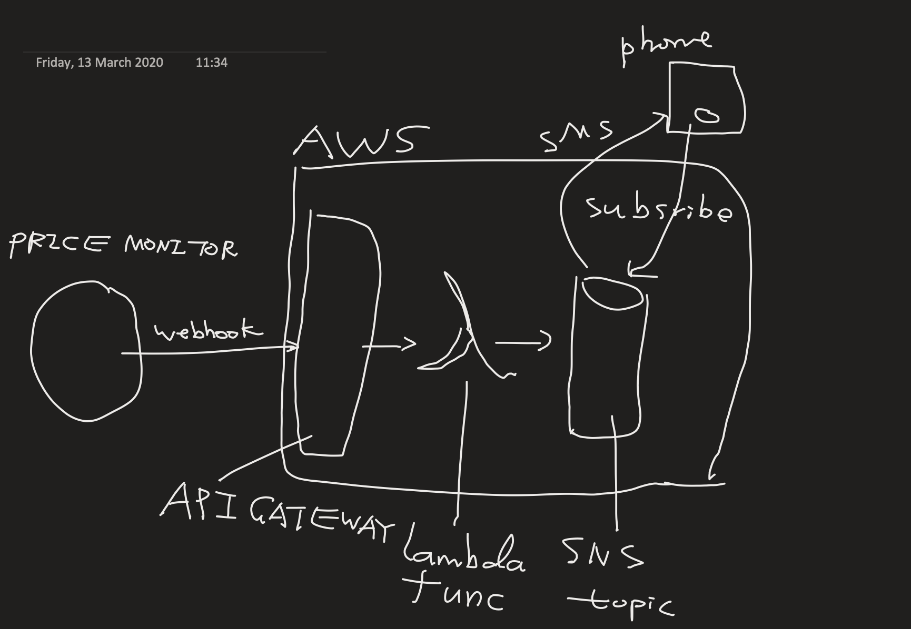

A simple service that will send me a text message when bitcoin price above/below certain price.

## Some Thoughts
I has this need to track bitcoin price for my friend, so I could buy coins for him once the price reaches below certain price.

Most coin price monitoring websites offer email notification for free, not for SMS. So I thought I could build a 'free' SMS notification service.

I want this to be done quickly, so give serverless a go, turned out it's really quick to build APIs once the infrastructure is ready.

There are many ways to spin up AWS infrastructure: 
- terraform
- cloud formation
- cli
- aws console

Through console is quick to try out things, but not maintainable

CLI is handy for ops work, has early access to new features, but complicate for infrastructure provisioning

Terraform is good for infrastructure as code, but feature updates can be slow.

### Prerequisite
- An AWS account
- An IAM admin role in place (AWS common sense)

> The steps below can be covert to a shell script, can extract output as next command's input via tools like jq  

### Setup a SNS topic and its subscribers

`aws sns create-topic --name my-topic --profile ${profile-name}`

`aws sns subscribe --topic-arn ${topic-arn} --protocol ${protocol} --notification-endpoint ${endpoint} --profile ${p}` 

eg. protocol: sms, endpoint: +4412345678

### Create lambda execution role

Create a role for lambda execution  

`aws iam create-role --profile ${p} --role-name ${my-lambda-exec-role} --assume-role-policy-document file://assume-role-policy.json`

Attach 2 policies to the role  
- arn:aws:iam::aws:policy/service-role/AWSLambdaBasicExecutionRole
- arn:aws:iam::aws:policy/AmazonSNSFullAccess

`aws iam attach-role-policy --profile ${p} --role-name ${my-lambda-exec-role} --policy-arn arn:aws:iam::aws:policy/{ROLE}`

### Build lambda function

Build the go file

`GOOS=linux go build bitcoin-alerting-func.go`  

Zip it  
`zip func.zip bitcoin-alerting-func`  

Create a lambda function to publish message to a SNS topic, which in turn will send messages to its subscribers,
and return 200 (a requirement from cryptocurreyalerting.com webhook)

`aws --profile ${p} lambda create-function --function-name ${my-lambda-func} --zip-file fileb://func.zip --handler ${my-lambda-func} --runtime go1.x --role ${lambda-exec-role-arn}`

lambda-exec-role-arn format: `arn:aws:iam::${iam-user-id}:role/${role-name}`

### Create API via apigatewayv2

apigatewayv2 creates HTTP API, POST endpoint, deploy to prod. have the url to added to [cryptocurrencyalerting.com](cryptocurrencyalerting.com)'s webhook config, this API integrates with lambda function

> It seems that the integration is not working via cli, so the walk around is to create a default endpoint, then create route, then attach integration via console

Create API (quick create):
`aws apigatewayv2 create-api --name my-rest-api --protocol-type HTTP --target ${my-lambda-func-arn} --profile ${p}`

Create route:  
`aws apigatewayv2 create-route --profile ${p} --api-id ${api-id} --route-key "POST /alerts"`

### Config webhook

Config a webhook in [cryptocurrencyalerting.com](cryptocurrencyalerting.com), specify desired condition to trigger the webhook